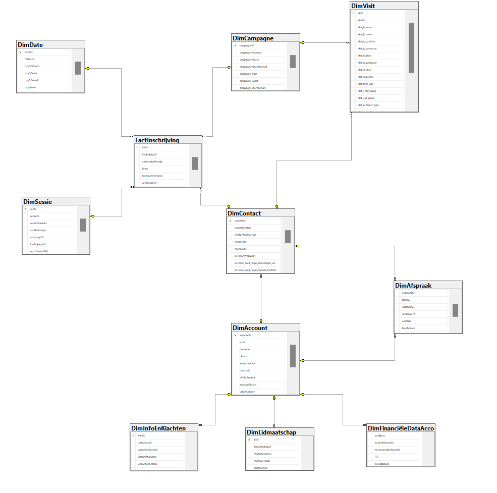
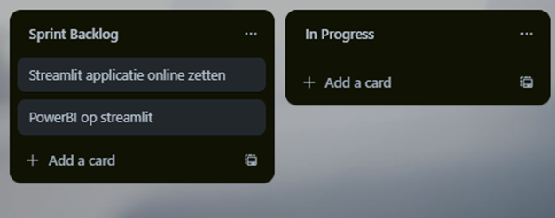

# Eindrapport Data-Engineering-Project 2 -- Groep 2

## Epic 1

`Korte uitleg van de epic`

Het doel van deze epic was dat een keyuser  de aangeleverde vokaledendata volledig kan consulteren in de omgeving van HoGent, en dat deze ad hoc queries kan uitvoeren om data kwaliteit te valideren.

Hiervoor hebben we een relationele databank opgezet waarin de aangeleverde data wordt bijgehouden. Deze data hebben we eerst gecleaned en enkel de data van Oost-Vlaanderen behouden. Vervolgens hebben we de data in een relationele databank gestoken. Deze databank dient dus voor de toestroom aan data. Daarna hebben we een Data Warehouse opgesteld die meer geschikt is voor het ophalen en analyseren van data. Tot slot hebben we ook een User Interface gemaakt (waar de data warehouse aan gelinkt is), a.d.h.v Streamlit waarop bepaalde queries kunnen worden uitgevoerd. Deze queries kunnen zelf geschreven worden en er zijn ook enkele voorgemaakte queries beschikbaar.

`Beperkingen en uitdagingen`

Het cleanen van de data was een lastige taak. Er was veel data die niet bruikbaar was (NaN waarden) en er waren ook veel verschillende formaten. Er zat weinig structuur in de data en die hebben we zelf moeten toevoegen wat veel tijd in beslag nam. Ook waren er veel problemen met de Foreign Keys en Primary Keys (niet bestaande primary key waarvan er wel een foreign key was bijvoorbeeld). De data types klopten ook niet altijd en moesten we vaak zelf aanpassen (zo kregen we de doorgestuurde datums bijvoorbeeld als strings idp datetime-objecten).

Daarnaast was het ook een uitdaging om de juiste layout voor de Data Warehouse te vinden. We hebben deze een aantal keer opnieuw moeten maken. Uiteindelijk zij we geland op een DWH met 1 facttable (nl FactInschrijving), dit omdat inschrijvingen eigenlijk hetgene is dat Voka 'verkoopt', dit is het product die ze eigenlijk aanbieden aan de bedrijven die ingeschreven zijn bij hun. Ook hebben we een deel data laten vallen en anders gestructureerd hier. Dit omdat niet alle oorspronkelijke data nuttig was voor de analyses/epics die wilden maken. Tot slot was het ook een uitdaging om de DWH op het VIC te krijgen. Eerst hadden we namelijk de pipeline lokaal opgezet let Integration Services in Visual Studio. Op het VIC hebben we dit dan opgelost met Views.

`Bepaalde keuzes door beperkingen`

Soms hebben we enkele rijen data moeten laten vallen aangezien er hier weinig tot geen nuttige informatie in stond (veel NaN waarden). Dit heeft misschien tot gevolg dat er sommige bedrijven die wel in de data zitten niet meer in de uiteindelijke databank zitten.

`Gedachtengang / Hoe zijn we tot de oplossingen gekomen`

Eerst en vooral dienden heel wat algemene cleanups te gebeuren, zoals het verwijderen van / opvullen van NaN waarden. Ook hebben we de kolomnamen aangepast zodat deze meer leesbaar waren en allemaal hetzelfde formaat hebben. Daarnaast hebben we rijen moeten verwijderen die data hadden met Foreign Keys die verwezen naar niet-bestaande Primary Keys om geen problemen te krijgen met de databank. Als laatste hebben we ook nog de juiste datatypes moeten toekennen aan sommige kolommen (Bijvoorbeeld Float-getallen omgezet naar Integers en datums die als String in de data zaten, omgezet naar datatime-objecten).

We hebben de databank opgesteld aan de hand van het meegegeven ERD. Deze hebben we grondig geanalyseerd alvorens het opstellen van de databank. Vervolgens hebben we ons eigen ERD opgesteld, aangepast aan onze doorgevoerde wijzigingen. Dan hebben we met behulp van een Object Relational Mapper (ORM) de data in de database gestoken.

De data warehouse werd dan opgesteld aan de hand van een SQL-Server script. Het nodige Sterschema werd hier ook bij ontwikkeld. Tot slot wordt de data warehouse gevuld met behulp van views voor elke tabel van de DWH. De views halen de juiste data uit de relationele databank en steken deze in de DWH.



## Epic 2

`Korte uitleg van de epic`

Het doel van epic 2 was het mogelijk maken om als keyuser nieuwe data (volgens hetzelfde model) vlot toe te voegen . Dit gaat typisch over de recentste gedragsdata, transactionele data en veranderingen in master data. Wij hebben dit mogelijk gemaakt door middel van een gegeven CSV bestand. Dit CSV bestand wordt dan ingelezen en de data wordt toegevoegd aan de databank.

`Beperkingen en uitdagingen`

Het inlezen van de CSV bestanden was niet zozeer een uitdaging. Waar we wel wat moeilijkheden ervaren hebben, was bij het zorgen dat deze bestanden telkens dezelfde naam hebben. Ook is er mogelijks een probleem dat er fouten in de data zitten die niet opgemerkt worden, zoals verkeerde separators. Er waren ook problemen bij het toevoegen van reeds bestaande data, dit met foreign keys en primary keys.

`Bepaalde keuzes door beperkingen`

Doordat er problemen waren met de foreign keys en primary keys hebben we besloten om de data die al in de databank zit niet te overschrijven. Dit om geen problemen te krijgen met de databank. Hierdoor werkt deze epic dus enkel voor nieuwe data.

`Gedachtengang / Hoe zijn we tot de oplossingen gekomen`

We hebben de oorspronkelijke manier om de databank te vullen gebruikt, dus aan de hand van een ORM. We hebben de data ingelezen en vervolgens de data toegevoegd aan de databank. We gebruiken telkens een python script, hier wordt de cleanup (uit de vorige epic) reeds gedaan. Dit zorgt ervoor dat de data uit het CSV bestand en de data uit de databank dezelfde structuur hebben.

## Epic 3

`Korte uitleg van de epic`

Het doel van epic 3 was dat een keyuser voor een contact een lijst met toekomstige kan campagnes genereren volgens de waarschijnlijkheid dat deze zou inschrijven volgens vorige inschrijvingen, bezoekverslagen, eigenschappen van de contact zelf en zijn bedrijf, lookalikes. NOG AANVULLEN

`Beperkingen en uitdagingen`

`Bepaalde keuzes door beperkingen`

`Gedachtengang / Hoe zijn we tot de oplossingen gekomen`

`Welke data / parameters zijn er gebruikt`

`Waarvan is er te weinig data`

## Epic 4

`Korte uitleg van de epic`

Het doel van epic 4 was dat een keyuser voor een contact met weinig transacties een lookalike met veel transacties kan identificeren. Ook zou er dan een clustering gemaakt moeten worden van contactpersonen qua jobinhoud, type bedrijf, voorkeuren en (verwacht) gedrag. Hier hebben we dan ervoor gezorgd dat er op basis van een gegeven contactID en een gekozen campagne van dit contact, lookalikes worden gegenereerd. Dit zijn contactpersonen die het meest lijken op het gegeven contact. Ook worden deze gesorteerd van meest naar minst gelijkend op het gegeven contact.

`Beperkingen en uitdagingen`

Een uitdaging was het mogelijk maken dat er een lookalike gegenereerd kon worden op basis van een campagne. Dit had de klant als feedback gegeven.

`Bepaalde keuzes door beperkingen`

Er zijn niet superveel campagnes en contacten van Oost-Vlaanderen. Daarom hebben we gekozen om gebruik te maken van cosinus similariteit van de keyphrases van de contactpersonen. Dit is een eenvoudige manier om de contactpersonen te vergelijken met elkaar en zo de meest gelijkende te vinden zonder dat we een model moeten trainen.

`Gedachtengang / Hoe zijn we tot de oplossingen gekomen`

We hebben besloten om eerst alle data van contact, campagnes, afspraken en inschrijvingen samen te voegen. Daarna hebben we de dataset gevectoriseerd met TF-IDF. Vervolgens hebben we de cosinus similariteit berekend tussen de vector van het gegeven contact en alle andere contacten.

`Welke data / parameters zijn er gebruikt`

```Text
De gebruikte Machine Learning technieken zijn:
```

- TFIDF-Vectorization
- Cosinus Similariteit

Voor beide technieken hebben we gebruik gemaakt van de Scikit-Learn library.

```Text
De gebruikte kolommen zijn:
```

- Account
  - plaats, subregio, ondernemingstype, ondernemingsaard
- Contact
  - contactID, functietitel, functieNaam
- Activiteit
  - activiteitNaam
- Campagne
  - campagneID, campagneType, campagneNaam, campagneSoort
- Afspraak
  - keyphrases

`Waarvan is er te weinig data`

Er is niet zozeer te weinig data, maar er kan gekozen worden om meer kolommen te gebruiken zodat de lookalikes nog beter overeenkomen met het gegeven contact.

## Epic 5

`Korte uitleg van de epic`

Het doel van epic 5 was dat een keyuser voor een campagne een lijst met contacten kan genereren volgens de waarschijnlijkheid om in te schrijven voor die campagne. Ook moest ervoor gezorgd worden dat bij de sortering contacten met weinig marketing pressure bevoordeeld worden ten opzichte van contacten met een hoge marketing pressure.

Wij hebben er dan voor gekozen om op basis van een gegeven campagneID, een aantal contactpersonen aanbevelen die het meest geschikt zouden zijn voor deze bepaalde campagne. Deze contactpersonen worden dan gesorteerd van hoge naar lage marketing pressure.

`Beperkingen en uitdagingen`

Er was niet superveel data om een goed model mee te trainen. Ook zijn er soms meerdere contactpersonen per bedrijf wat het een extra uitdaging maakte om de data voor te bereiden voor het aanbevelingssysteem. LEG HIER KEER UIT WAAROM DA DA UITDAGING IS

`Bepaalde keuzes door beperkingen`

Aangezien er weinig data was hebben we gekozen om gebruik te maken van cosinus similariteit van de keyphrases van de contactpersonen. Dit is een eenvoudige manier om de contactpersonen te vergelijken met elkaar en zo de meest geschikte te vinden zonder dat we een model moeten trainen. WAAROM

`Gedachtengang / Hoe zijn we tot de oplossingen zijn gekomen`

Na eerst te hebben geprobeerd met Clustering models en de Surprise library hebben we uiteindelijk gekozen om gebruik te maken van TFIDF-Vectorization en Cosinus Similariteit. WAAROM

`Welke data / parameters zijn er gebruikt`

```Text
De gebruikte Machine Learning technieken zijn:
```

- TFIDF-Vectorization
- Cosinus Similariteit

Voor beide technieken hebben we gebruik gemaakt van de Scikit-Learn library.

```Text
Om de keyphrases te maken hebben we volgende kolommen gebruikt:
```

- Account
  - plaats, subregio, ondernemingstype, ondernemingsaard
- Activiteit
  - activiteitNaam
- Functie
  - functietitel
- Afspraak
  - thema, onderwerp, keyphrases, afspraak_betreft
- Campagne
  - naam, type, soort
- Mailing
  - naam, onderwerp
- Sessie
  - thema_naam

```Text
Om de marketing pressure te bereken hebben we volgende kolommen gebruikt:
(In de user interface kan je zelf kiezen welke kolommen je wilt gebruiken)
```

- Persoon
  - alle kolommen met mail_thema en mail_type, marketingcommunicatie
- CDI_Visit
  - bron, visit_first_page, visit_total_pages
- Mailing
  - bij mailing hebben we de mail_click_frequency berekend per account

`Waarvan is er te weinig data`

Er zijn te weining campagnes en accounts van Oost-Vlaanderen.

## Epic 7

`Korte uitleg van de epic`

`Beperkingen en uitdagingen`

`Bepaalde keuzes door beperkingen`

`Gedachtengang / Hoe zijn we tot de oplossingen zijn gekomen`

`Welke data / parameters zijn er gebruikt`

`Waarvan is er te weinig data`

## Epic 8

`Korte uitleg van de epic`

Het doel van epic 8 was om de mogelijkheid te creeren waarbij een key user een lijst van accounts (dus ingeschreven bedrijven) kan genereren die het meest waarschijnlijk zijn om hun lidmaatschap het komende jaar NIET te vernieuwen.

`Beperkingen en uitdagingen`

Een redelijke uitdaging bij deze epic was het feit dat er niet veel data was om een model mee te trainen. Dit had als effect dat de accuracy van het model niet heel hoog lag. Een uiteindelijk doel zou zijn om meer data te hebben voor accounts uit de regio Oost-Vlaanderen. Nu hadden we een train_set van iets meer dna 5000 accounts, en een test set van iets meer dan 1000 accounts.

`Bepaalde keuzes door beperkingen`

Ondanks de beperkte hoeveelheid data voor de accounts hebben we toch gekozen voor het trainen van een aantal welgekende Machine Learning modellen. Het resultaat was dus (zoals eerder vermeld) dat er minder accuracy was bij deze modellen (dit hebben we dan gewoon aanvaard). Een andere mogelijke oplossing was geweest om het model te trainen met de data van alle accounts, en niet enkel die van Oost-Vlaanderen. Hierdoor gingen we al een stukje meer data hebben en dus ook een hogere accuracy. Echter was de Data Warehouse waar we mee werken al opgebouwd voor enkel de regio Oost-Vlaanderen, dus hebben we hier gewoon mee verder gewerkt.

`Gedachtengang / Hoe zijn we tot de oplossingen zijn gekomen`

Om tot een model te komen die aan het einddoel voldoet, hebben we eerst de juiste data ingeladen. Dit bedroeg een dataframe van de data van de tabel DimAccount en de data van de tabel DimLidmaatschap. Na analyse van deze gegevens konden we concluderen dat de hoofdreden waarom mensen hun lidmaatschap opzeggen is dat ze 'geen gebruik' maken van hun lidmaatschap. Concreet wil dat dus zeggen dat ze geen/heel weinig inschrijvingen hebben voor campagnes van Voka. Daarnaast leek het ons zo dat de financiële gegevens van de accounts ook een impact zouden moeten hebben op een eventuele stopzetting van het lidmaatschap. Omwille van die reden hebben we ook enkele kolommen van de tabel DimFinanciëleDataAccount toegevoegd aan de dataframe. Vervolgens zijn er een aantal kolommen toegevoegd/gecreerd geweest: boekjaar, aantal_inschrijvingen, lidmaatschap_actief. De lidmaatschap_actief kolom is gebaseerd op de opzegDatum kolom van DimLidmaatschap. Als deze gelijk is aan '2026-1-1' dan zal deze waarde gelijk zijn aan 1, dit wijst er dus op dat voor dit account het lidmaatschap nog actief is (anders 0). Deze kolom is dus ook hetgene dat we willen voorspellen met ons model. De kolom boekjaar bedraagt het jaar VOOR het jaar van de opzegdatum, en de kolom aantal_inschrijvingen bedraagt het aantal inschrijvingen in campagnes per account voor dat boekjaar. Dit is dus een gegeven die ons zicht geeft op het gebruik van het lidmaatschap. Na datacleaning (one hot encoding) hebben we gekozen om enkel te werken/trainen met features die een importance hebben van 0.01 of meer. Daarna hebben we een tiental modellen getraind en geëvalueerd. Na evaluatie hebben we het model gekozen met de hoogste recall-score. Dit wil zeggen dat het model het minst aantal false negatives heeft. Dit is belangrijk omdat we willen dat het model zo weinig mogelijk accounts mist die hun lidmaatschap zullen opzeggen. Beter een account te veel voorspellen die zijn lidmaatschap niet zal opzeggen, dan een account te missen die zijn lidmaatschap wel zal opzeggen. Het model die bij deze redenering uit de bus kwam was de hard voting classifier met een recall-score van 81%.

`Welke data / parameters zijn er gebruikt`

```Text
De gebruikte Machine Learning technieken zijn:
- One Hot Encoding
- Grid Search
- Hard Voting Classifier
- Confusion Matrix
- ROC Curve

Voor deze technieken hebben we gebruik gemaakt van de Scikit-Learn library.
```

```Text
De gebruikte kolommen zijn:
- DimAccount
  - accountID, plaats, isVokaEntiteit, ondernemingstype, activiteitNaam
- DimLidmaatschap
  - redenAangroei, redenVerloop, startDatum, opzegDatum, 
- DimFinanciëleDataAccount
  - toegevoegdeWaarde (matchend op boekjaar kolom die gecreëerd is)
- Overige
  - boekjaar, aantal_inschrijvingen, lidmaatschap_actief
```

`Waarvan is er te weinig data`

Zoals eerder vermeld, is er te weinig data voor accounts uit de regio Oost-Vlaanderen. Dit heeft als gevolg dat de accuracy van het model niet heel hoog ligt. Een uiteindelijk doel zou zijn om meer data te hebben voor accounts uit de regio Oost-Vlaanderen. Of om op algemene schaal te werken en alle regio's in de datawarehouse te gebruiken.

## Algemene reflectie

`Aangeleverde data`

`Datakwaliteit`

`Mogelijkheden / beperkingen om inzichten te verkrijgen`

## Sprintrapport sprint 6

`Product Backlog, wat ingepland was en werd gedaan`


`Wat hebben we meer gedaan dan gepland en waarom?`
Wij hadden gepland om deze sprint te gebruiken voor algemene cleanup en afwerking. Ook hebben we deze sprint ons einddossier volledig uitgewerkt.

`Wat hebben we minder gedaan dan gepland en waarom? Hoe kunnen we dit beperken om op schema te blijven?`
Niets, we hadden gepland om deze sprint als ‘reserve’ te zien zodat we nog eventuele problemen konden oplossen en code konden organiseren.
We hebben de Streamlit applicatie niet online beschikbaar kunnen maken omdat er op het VIC geen poort voorzien is. Het is dus niet mogelijk dat je via het VIC een poort openstelt op het internet. Ook hebben we onze PowerBI rapporten niet in onze Streamlit applicatie kunnen integreren omdat je hier bepaalde toelatingen nodig hebt van je Microsoft account beheerder.

`Team Progressie`
Aangezien alle voorziene epics waren afgewerkt zoals gehoopt, konden we deze sprint gebruiken als ‘extra’ om de nodige cleanup en afwerking uit te voeren. Ook hebben we samen het einddossier geschreven waar alle details over de uitgewerkte epics in terug te vinden zijn. Over het algemeen was ook tijdens deze sprint de groepssfeer en samenwerking zeker optimaal. We hebben geen nieuwe problemen ondervonden hierbij en de communicatie over zowel de afwerking als het einddossier verliep vlot.
